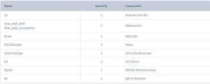
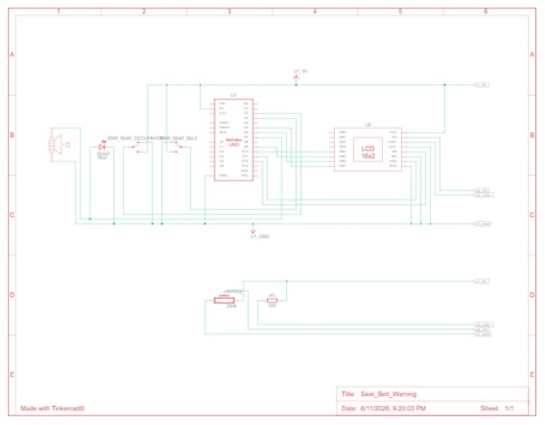

# 🚗 Seat Belt Warning System using Arduino

## 📖 Overview

The **Seat Belt Warning System** is an Arduino-based embedded system project designed to improve passenger safety by monitoring seat occupancy and seat belt status. The system provides **visual**, **audible**, and **display-based warnings** when a passenger occupies the seat without fastening the seat belt.

The project was designed and simulated using **Tinkercad** and implemented using **Arduino programming**.

---

## 🎯 Objectives

- Detect seat occupancy using a switch
- Detect seat belt fastening status using a switch
- Generate a warning when the seat belt is not fastened
- Provide visual indication through an LED
- Provide audible alerts through a buzzer
- Display system status on a 16x2 LCD display

---

## 🛠 Components Used

| Component | Quantity |
|---|---|
| Arduino Uno R3 | 1 |
| Slide Switch | 2 |
| Red LED | 1 |
| Piezo Buzzer | 1 |
| LCD 16x2 Display | 1 |
| Potentiometer | 1 |
| 220Ω Resistor | 1 |
| Breadboard | 1 |
| Connecting Wires | As Required |

---

## ⚙ Working Principle

The system continuously monitors two inputs:

1. **Seat Occupancy Status** — detects whether a passenger is seated
2. **Seat Belt Status** — detects whether the seat belt is fastened

### System Behaviour

| Condition | LED | Buzzer | LCD Display |
|---|---|---|---|
| Seat Empty | OFF | OFF | "Seat Empty" |
| Seat Occupied, Belt Not Fastened | 🔴 ON | 🔔 ON | Warning message |
| Seat Occupied, Belt Fastened | OFF | OFF | Safe status message |

---

## 💻 Software and Tools

- [Tinkercad](https://www.tinkercad.com/) — Circuit design and simulation
- [Arduino IDE](https://www.arduino.cc/en/software) — Code development and upload
- [GitHub](https://github.com/) — Version control and project hosting

---

## 📂 Source Code

The complete Arduino source code is available in:

[seat_belt_warning.ino](seat_belt_warning.ino)

---

## 🚀 How to Run

1. Open the project in **Tinkercad**
2. Assemble the circuit according to the schematic
3. Upload the Arduino code
4. Start the simulation
5. Toggle the switches to simulate different conditions
6. Observe the **LCD**, **LED**, and **buzzer** outputs

---

## 🖼 Project Images

**Components List**

**Circuit Schematic**

**Circuit Design in Tinkercad**

---

## 🎥 Project Demonstration

A complete explanation and working demonstration of the project is available in the video below:

📹 **Video Link:**
 **Demo Video (Google Drive):**

The demonstration covers:
- Project introduction
- Components used
- Circuit connections
- Arduino code explanation
- Working simulation
- Output demonstration

---

## 🔮 Future Enhancements

- Real seat pressure sensor integration
- Wireless alert system
- Mobile application notifications
- Multi-seat monitoring system
- Vehicle ignition lock integration

---

## 👨‍💻 Author

**Varun Kumar**  
B.Tech Computer Science Engineering  
Chandigarh Group of Colleges, Landran

---

## 📄 License

This project is created for **educational and learning purposes** only.
